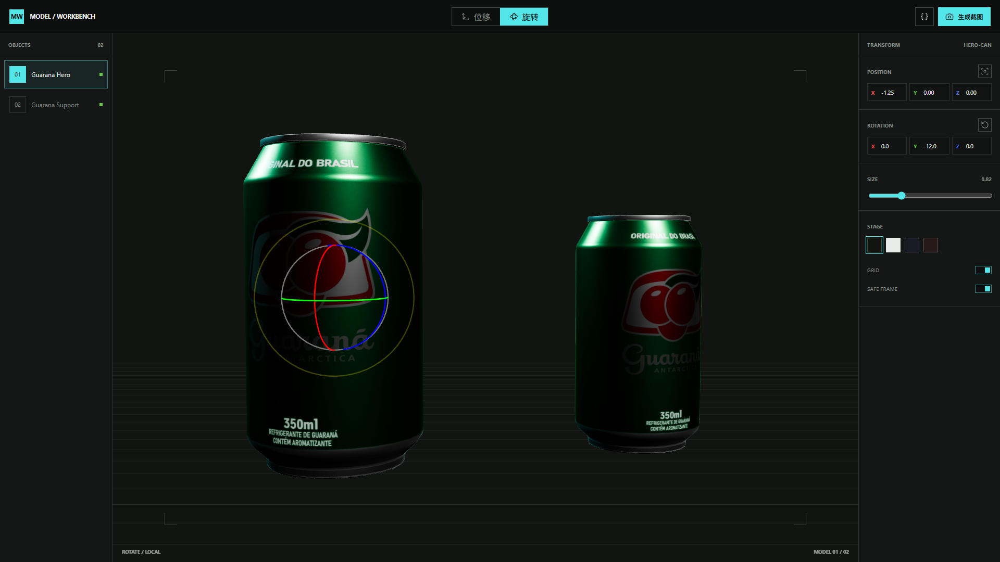

# Open Model Workbench

一个面向视觉创作与 3D 网页工作流、可以开箱即用的 **3D 模型构图工作台 Codex Skill**。

把一个或多个 GLB/GLTF 模型交给 Codex，自动在本地生成并打开一套桌面 3D 构图工具。用户可以直接摆放、旋转和缩放模型，再导出干净的网页构图截图与可复现的布局数据。



### 它解决什么问题

直接让生成式 AI 根据文字猜测 3D 网页构图，主体位置、朝向和比例很容易失控。这个 Skill 把构图提前变成一个可操作步骤：

1. 用户提供真实模型。
2. Codex 自动搭建并打开本地工作台。
3. 用户亲手确定模型的位置、角度和大小。
4. 导出的 PNG 可以继续交给 Image 2 生成网页设计稿。
5. 导出的 JSON 可以让后续网页实现复现同一套三维变换。

### 功能

- 支持一个或多个 `.glb` / `.gltf` 模型
- 自动复制 GLTF 的本地纹理与 `.bin` 依赖
- 支持 Draco 压缩模型
- 鼠标直接拖动模型
- 3ds Max 风格的局部三轴旋转环
- 精确的位置、旋转与缩放控制
- 深色、浅色等舞台背景切换
- 网格与 16:9 安全框
- 导出干净的 1920 x 1080 PNG
- 导出 `model-workbench-layout.json`
- 所有运行依赖均随 Skill 本地提供，不依赖 CDN
- 服务只绑定 `127.0.0.1`，模型不会上传到远程服务器

## 安装

把下面这段话发给支持 Skills 的 Codex Agent：

```text
请安装这个 Skill：
https://github.com/icejyzy0430/open-model-workbench/tree/main/open-model-workbench
```

安装完成后，在下一轮对话中说：

```text
打开模型工作台
```

如果本轮还没有模型，Agent 会只请求你提供一个或多个 GLB/GLTF 文件。收到模型后，它会自动生成工作台、选择空闲端口、启动本地服务并打开网页。

## 操作

| 操作 | 效果 |
|---|---|
| 鼠标拖动 | 在位移模式中移动所选模型 |
| `E` | 切换位移与旋转模式 |
| `F` | 将所选模型移回舞台中心 |
| `G` | 恢复所选模型的初始角度 |
| 左侧对象列表 | 在多个模型之间切换 |
| 生成截图 | 导出不包含 UI、网格和旋转环的 PNG |
| `{ }` 按钮 | 导出布局 JSON |

## 可选初始配置

需要预设模型位置、背景或截图尺寸时，可以在模型目录加入 `composer.json`。完整字段见 [`config-schema.md`](open-model-workbench/references/config-schema.md)。普通用户不需要手写配置。

## 本地开发与验证

```powershell
python open-model-workbench/scripts/generate_workbench.py <模型目录> <输出目录>
python -m unittest discover -s open-model-workbench/tests -p "test_*.py" -v
```

Skill 本体位于 [`open-model-workbench/`](open-model-workbench/)。

## 赞助商
感谢SoloAPI对本次项目的token支持 
真正源头低价，支持任何形式检测，满血无掺水，支持一键式接入Codex，直连即可用，零配置难度
充一块钱可用1000万token的gpt5.6terra模型
QQ群563378586


## License

项目代码使用 [MIT License](LICENSE)。Three.js 与 Lucide 等第三方资源保留各自许可证，许可证文件随 Skill 一同分发。
